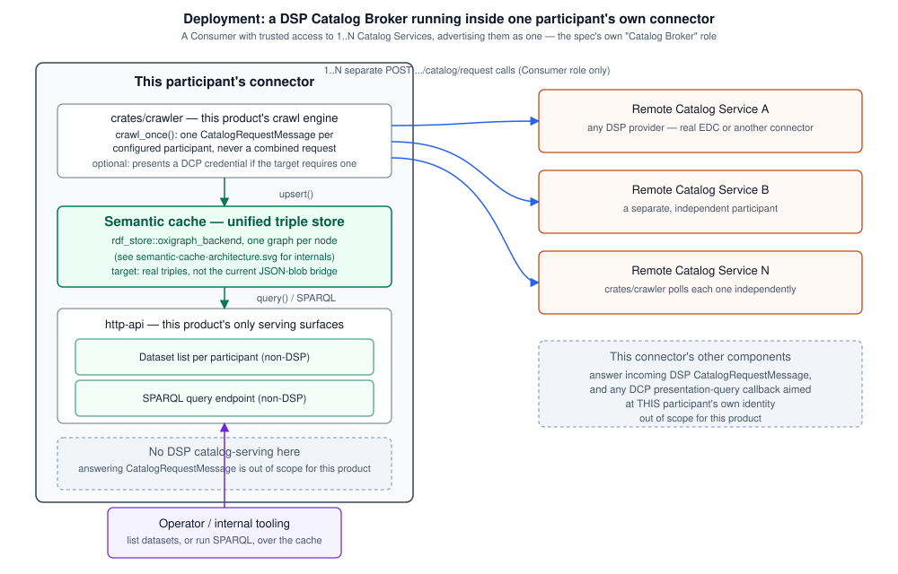
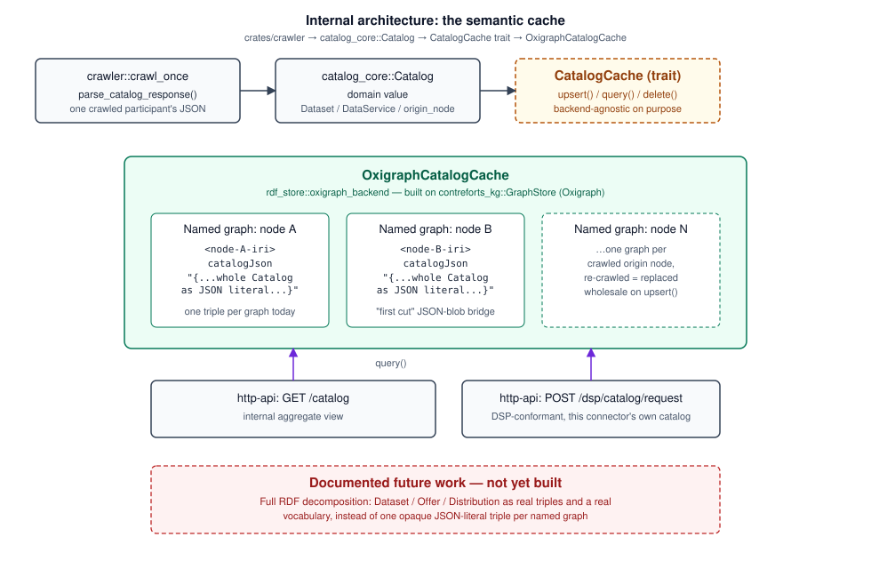

# Federated Catalog Semantic Harvester

*(repo/package name: `federated-catalog-rs`)*

An iterative, from-scratch Rust rewrite of [Eclipse EDC](https://projects.eclipse.org/projects/technology.edc)'s
**Federated Catalog** module — a **harvester** that plays the Dataspace
Protocol's Consumer role at one participant's own connector, crawling
1..N remote Catalog Services and landing the results in a **semantic
cache** (an RDF/Oxigraph-backed store, see
["The RDF backend"](#the-rdf-backend-semantic-cache) below) queryable
locally without re-crawling on every request.

## What this is (and isn't)

This is a rewrite, not a port. The goal is a Federated Catalog that behaves
like EDC's — a crawler periodically pulls catalogs from known dataspace
participants and makes the aggregate queryable — designed from scratch in
Rust, taking the *shape* of the problem from EDC's Java implementation
without transliterating its classes, package layout, or internal
abstractions. Where a design choice here differs from EDC's (see each
crate's doc comments for specifics), that's deliberate, not an oversight.

The rewrite proceeds crate by crate, iteration by iteration: each crate
starts as a minimal skeleton that compiles and passes its own tests, and
gets built out once the next layer needs more from it. Nothing here is
meant to be feature-complete on first commit.

## Relationship to Eclipse EDC Federated Catalog

Eclipse EDC's Federated Catalog crawls a directory of known target nodes,
fetches their Dataspace Protocol (DSP) catalogs, and caches the result so
it can be queried locally without crawling on every request. The
reference implementation (Java, Gradle, OSGi-style extension model) lives
upstream at [eclipse-edc/Connector](https://github.com/eclipse-edc/Connector);
this repo's starting point is v0.18.0 of that project.

The crate boundaries here echo the module boundaries EDC draws between
its `crawler-spi` (generic, protocol-agnostic crawling contracts) and
`federated-catalog-spi` (the catalog-specific cache and query layer on
top), but as separate Rust crates rather than Java SPI modules:

- `catalog-core` — domain types, loosely modeled on EDC's
  `federated-catalog-spi` / `catalog-spi`: a participant/node identifier,
  a crawl work item, and the `Catalog` / `Dataset` / `DataService` model.
- `rdf-store` — the storage abstraction a federated catalog cache needs:
  upsert a participant's crawled catalog as a named graph, query stored
  catalogs, delete one by node id. Storage-agnostic by design (see below),
  with an in-memory implementation and an Oxigraph-backed implementation
  (the "semantic cache" — see [Deployment model](#deployment-model-the-harvester-runs-at-participant-level) below).
- `dcp-core` — shared Decentralized Claims Protocol (DCP) primitives (JWS
  sign/verify, `did:web` resolution) used by both identity roles: the
  verifier side in `http-api` and the holder side `crawler` uses to
  present its own credential to a DCP-gated participant.
- `crawler` — the harvester itself: a local-config participant registry,
  a scheduled crawl loop (`spawn_scheduler`/`crawl_once`), and a lenient
  DSP-response parser tolerant of real Eclipse EDC's JSON-LD shape, not
  just this project's own.
- `http-api` — an Axum HTTP server exposing the catalog cache over HTTP:
  a real, `dsp-tck`-verified DSP catalog protocol surface
  (`POST /dsp/catalog/request`, `GET /.well-known/dspace-version`), an
  internal Management-API-style `GET /catalog`, and optional DCP-gated
  auth.

## Deployment model: the harvester runs at participant level

`crates/crawler` is meant to run **inside one dataspace participant's own
connector** — it plays the Dataspace Protocol's **Consumer** role, not a
new kind of shared infrastructure. This isn't a design preference; it's
what the [Dataspace Protocol specification](https://eclipse-dataspace-protocol-base.github.io/DataspaceProtocol/2025-1/)
itself says federation is:

> "The Catalog Protocol is designed to be used by federated services
> without the need for a replication protocol. Each Consumer is
> responsible for issuing requests to 1..N Catalog Services, and managing
> the results."
> — [`catalog.protocol.md`, "Replication Protocol"](https://github.com/eclipse-dataspace-protocol-base/DataspaceProtocol/blob/main/specifications/catalog/catalog.protocol.md)

Concretely: `crawl_once` issues one separate `POST .../catalog/request`
per configured participant — never a single combined "give me everyone's
catalog" request, because DSP has no such request. There is no
"federation" message type in the protocol; aggregating multiple
participants' catalogs is explicitly the *consumer's* job, done by
crawling each one and managing the results locally. That's what this
crate does.

This also settles a question the project's own benchmarking work raised:
`http-api` exposes **two different surfaces**, and only one of them is
meant to represent the harvested aggregate:

- `GET /catalog` — an internal, non-DSP, Management-API-style endpoint.
  This is where the harvested aggregate belongs: it's for this
  participant's own operator/tooling, the same way EDC's federated
  catalog is queried through its own Management API, not through its DSP
  endpoint.
- `POST /dsp/catalog/request` — the real, spec-conformant DSP surface.
  Per the DSP `Catalog` schema's own worked example
  ([`catalog/example/nested-catalog.json`](https://github.com/eclipse-dataspace-protocol-base/DataspaceProtocol/blob/main/artifacts/src/main/resources/catalog/example/nested-catalog.json)),
  a `Catalog`'s nested `catalog` array is for one provider's own
  sub-catalogs (referenced by their own fetchable endpoint, with no
  `participantId` of their own) — not for inlining *other, distinct*
  participants' full catalogs under a shared wrapper. This connector's
  DSP endpoint should answer with this connector's own hosted catalog,
  the same as any DSP provider; it should not attempt to re-expose the
  harvester's cross-participant aggregate as if it were one participant's
  catalog. (`compliance/harvest-benchmark-2026-08-27.md` currently
  compares that aggregate view against EDC's own federated-catalog
  Management API using `/dsp/catalog/request` as a stand-in — a
  documented, known simplification for benchmarking purposes, not a
  claim that this is the spec-correct place to serve it long-term.)



## Relationship to the `dataspace` study repo

This project originates from prior research done in the
[`dataspace`](https://labs.deepthought-solutions.net/Deepthought-Solutions/dataspace)
repository — a study of what's needed to deploy an EDC connector able to
host multiple participants. That repo's `docs/spikes/` directory holds
time-boxed, non-binding research spikes on the surrounding ecosystem
(other EDC-based connectors, integration points, framework comparisons),
and its `docs/adr/` directory records the architecture decisions that came
out of that research. The crawler architecture, cache semantics, and
query API described above were reconstructed there by reading EDC's
source directly (vendored as a submodule in that repo) before any Rust
code was written here.

## The RDF backend ("semantic cache")

`rdf-store` defines the cache trait as backend-agnostic on purpose. EDC
itself supports multiple `FederatedCatalogCache` backends (in-memory,
Postgres via a JSON column) behind one SPI; this project has landed on an
actual RDF store — since a federated catalog is naturally a set of named
graphs. A research spike in the `dataspace` repo's `docs/spikes/` surveyed
the Rust RDF/quad-store ecosystem and recommended
[Oxigraph](https://crates.io/crates/oxigraph) as the target backend, and
`rdf-store`'s `oxigraph_backend::OxigraphCatalogCache` implements
`CatalogCache` on top of it — via `contreforts-kg`, an existing internal
Oxigraph wrapper from a separate private repo, rather than the bare
`oxigraph` crate directly.

`http-api` uses this backend whenever a harvester config is supplied
(`CRAWLER_CONFIG_PATH` set) — in-memory Oxigraph only, matching EDC's own
federated-catalog cache, which has no on-disk persistence option either;
crawled data is expected to be repopulated on every restart, not durably
stored. With no harvester configured, `http-api` falls back to a plain
`InMemoryCatalogCache` (a bare `HashMap`, not RDF-backed at all) seeded
with one placeholder catalog — unchanged, original behavior for anyone
not using the harvester.

Today it's still a "first cut" JSON-blob bridge, not full RDF
decomposition: one named graph per origin node, one triple per graph,
carrying the whole crawled `Catalog` as an opaque JSON literal. See
`rdf-store`'s own module docs for the exact quad-mapping scheme and why
that's a deliberate, documented simplification rather than an oversight.



## Vendored dependencies

`contreforts-kg` and its own two hard dependencies (`contreforts-core`,
`contreforts-config`) are vendored as git submodules under `vendor/` and
are real members of this workspace - not a separate, excluded one - so
this repo's own root `Cargo.toml` decides their shared dependency
versions and feature defaults (including Oxigraph's `rocksdb` feature).
See [`vendor/README.md`](vendor/README.md) for what's vendored, why, and
a known metadata caveat (inherited `license`/`edition` on those crates
doesn't match their own upstream `Cargo.toml`).

## Compliance and benchmarks

`http-api` speaks the real Dataspace Protocol wire format: `MET:01-01`
and `CAT:01-01/02/03` pass against the official
[`dsp-tck`](https://github.com/eclipse-dataspacetck/dsp-tck) (contract
negotiation and transfer process are explicitly out of scope for a
federated catalog, by deliberate choice — see
[`compliance/README.md`](compliance/README.md)). [`compliance/`](compliance/)
also holds three real, reproducible benchmark rounds against Eclipse EDC
0.18.0 (built from published Maven Central artifacts, no vendored source
touched):

- [`benchmark-2026-08-27.md`](compliance/benchmark-2026-08-27.md) — DSP
  catalog-request throughput/memory and a full wire-format fidelity
  comparison.
- [`benchmark-dcp-2026-08-27.md`](compliance/benchmark-dcp-2026-08-27.md) —
  real DCP auth overhead vs. a no-auth baseline and EDC's stub auth.
- [`harvest-benchmark-2026-08-27.md`](compliance/harvest-benchmark-2026-08-27.md) —
  the harvester itself, actively re-crawling two real EDC participants
  while under concurrent read load, against EDC's own real
  federated-catalog crawler component.

Each report documents its own methodology, real captured evidence, and
what it doesn't prove; each is fully re-runnable (see
`compliance/*/README.md` for the driver scripts).

## Layout

```
crates/
  catalog-core/   domain types (Catalog, Dataset, DataService, TargetNode, CrawlWorkItem)
  rdf-store/      CatalogCache trait + in-memory and Oxigraph-backed ("semantic cache") implementations
  dcp-core/       shared DCP JWS/did:web primitives (verifier + holder roles)
  crawler/        the harvester: participant registry, scheduled crawl loop, DSP response parser
  http-api/       Axum server: DSP catalog protocol, GET /catalog, optional DCP-gated auth
docs/
  diagrams/       architecture SVGs referenced from this README
vendor/
  contreforts-kg/      Oxigraph wrapper (GraphStore, QueryEngine) - rdf-store's real backend
  contreforts-core/    contreforts-kg's own dependency (shared error/connector types)
  contreforts-config/  contreforts-kg's own dependency (a second, separate Oxigraph store)
compliance/
  README.md                  dsp-tck compliance harness
  benchmark-*.md              three benchmark reports (see above)
  crawler-edc-fixture/        real EDC 0.18.0 participant fixtures, built from Maven Central
  harvest-bench/              end-to-end harvester-vs-EDC benchmark driver
```

## Building and testing

```bash
cargo build --workspace
cargo test --workspace
```

## License

Apache-2.0, matching upstream Eclipse EDC. See [LICENSE](LICENSE).
